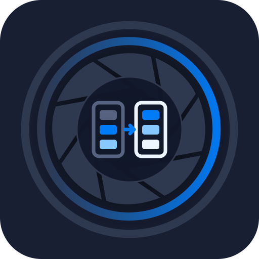

<p align="center">
  
</p>

# ChromaLib

ChromaLib provides typed, reusable ICC colour transforms for Dart. It keeps
pixel decoding and application policy outside the package, uses Little CMS when
profile identity changes, and converts layouts directly when it does not.

## Features

* Embedded ICC v2 and v4 profiles supported by Little CMS.
* Built-in sRGB, Adobe RGB (1998), ProPhoto RGB, Gray Gamma 2.2, D50 XYZ, and
  D50 Lab profiles.
* Gray, RGB, CMYK, Lab, and XYZ buffers with 8-bit, 16-bit, 32-bit floating-point,
  or 64-bit floating-point samples where the representation is meaningful.
* Straight or premultiplied trailing alpha, preserved outside the colour
  transform.
* Perceptual, relative colorimetric, saturation, and absolute colorimetric
  rendering intents, with optional black-point compensation.
* Native assets on Android, iOS, Linux, macOS, and Windows, plus WebAssembly in
  browsers.
* Extended-range floating-point transforms for HDR-capable ICC pipelines,
  including unbounded v4 multi-process elements.
* Exact sample-layout conversion for identical built-in or embedded profiles,
  without a colour-pipeline round trip.

The package has no image decoder, encoder, widgets, or document model. A codec
supplies decoded pixels and an ICC payload; ChromaLib converts those pixels to
the colour space selected by the caller.

## Native setup

A normal application only adds the dependency:

```console
dart pub add chromalib
```

The first native build downloads the pinned Little CMS source archive into the
application's shared `.dart_tool` hook cache, verifies its SHA-256, compiles it,
and bundles the resulting code asset. The Little CMS source tree is absent from
the ChromaLib archive published to pub.dev. A system Little CMS installation is
neither used nor required.

For an offline build, download and verify the source before disconnecting:

```console
dart run chromalib:prepare_library
```

This places the same pinned source beside ChromaLib's native bridge. Use
`--force` to replace an existing copy.

## Web setup

Flutter bundles ChromaLib's precompiled ES module and WebAssembly binary from
its Web-only package assets. Call `initialize` before constructing a transform:

```dart
await ChromaLib.initialize();
```

The WebAssembly module is produced at release time from the same verified
Little CMS archive and pinned Emscripten version as documented in
`tool/web_library_builder.dart`. Web consumers therefore need no C compiler or
Emscripten installation.

For plain Dart Web projects, copy `chromalib.mjs` and `chromalib.wasm` to a
public directory and pass its URL to `ChromaLib.initialize(assetBaseUrl: ...)`.
Relative URLs resolve against the document base URL, or against the worker
location inside a Web worker. The module is loaded with a dynamic `import()`,
so no inline script or evaluation permission is required.

## Usage

```dart
import 'dart:typed_data';

import 'package:chromalib/chromalib.dart';

Uint8List convertToDisplay(
  Uint8List premultipliedPixels,
  Uint8List embeddedProfile,
) {
  return transformPixels(
    premultipliedPixels,
    sourceProfile: IccProfile.fromBytes(embeddedProfile),
    sourceFormat: IccPixelFormat.premultipliedRgba8,
    destinationProfile: IccProfile.srgb,
    destinationFormat: IccPixelFormat.premultipliedRgba8,
    options: const IccTransformOptions(
      renderingIntent: IccRenderingIntent.relativeColorimetric,
      blackPointCompensation: true,
    ),
  );
}
```

Compile an `IccTransform` once and reuse it for several buffers with the same
profiles, pixel layouts, and rendering options. `convertInto` writes into a
caller-owned buffer of exactly the destination size, avoiding one allocation per
frame or tile. Call `close` when the transform is no longer needed.

## Pixel contract

Pixels are tightly packed, row-major, and interleaved. Alpha, when present, is
the last component. Integer channels are normalized over their complete range.
Floating RGB, gray, and CMYK components use zero through one for normalized
profiles, but may carry finite values outside that range when the ICC pipeline
supports extended-range data. Floating Lab and XYZ components use their
standard physical ranges. Sixteen-bit and floating samples are little-endian.
Float64 preserves a caller's 64-bit buffer layout, while Little CMS evaluates
the colour pipeline itself at single precision.

Transforms whose profiles have the same built-in identity or byte-identical ICC
payloads preserve colour components directly. They only convert the requested
sample and alpha layouts; identical layouts are copied exactly.

ChromaLib copies embedded profile bytes during `IccProfile.fromBytes`, then
exposes an unmodifiable view. Transform output always belongs to Dart, and the
input and output buffers of `convertInto` must not overlap.

Premultiplied integer output is clamped before premultiplication, so every
colour component stays within its alpha even for out-of-gamut colours.

## Performance

8-bit transforms from the built-in RGB and Gray Gamma 2.2 profiles into RGB,
gray, or Lab use Little CMS's optimized integer formatters. RGB transforms also
use that path when both profiles select their matrix/TRC tags for the requested
intent, as many camera or display profiles do. Results match the floating-point
pipeline within rounding and are roughly ten times faster. Lab input and
profiles that select a classic or floating LUT, including hybrid profiles that
also contain matrix tags, remain on the floating path. Little CMS would
otherwise introduce visible interpolation error in out-of-gamut Lab colours,
16-bit data, and lookup-table transforms.

A conversion runs synchronously on the calling isolate. Convert large images in
a background isolate that owns its own `IccTransform`.

One `IccTransform` must not be used concurrently. Separate isolates or workers
should create separate transform instances.

## Rebuilding browser assets

Maintainers need Emscripten 4.0.15:

```console
dart run tool/web_library_builder.dart
```

The command downloads and verifies Little CMS when needed, then replaces the
published module in `assets/web/`.

## License

ChromaLib and Little CMS are MIT-licensed. See `THIRD_PARTY_NOTICES.md` for the
exact bundled dependency and source-retrieval details.

---

Built for **[Focale](https://focale-editor.app)**, an advanced local image editor. Discover what these packages make possible in a real creative workflow.
